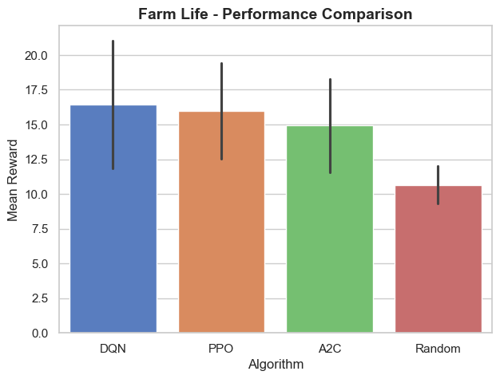

# 🌾 Farm of Life – A Conway’s Game of Life with a Farm Twist 🌱

## **Overview**
Farm of Life is a unique take on **Conway’s Game of Life**, where the evolving grid transforms into a **farm-like environment** with **wheat, flowers, and a farmer agent**. The farmer, trained using **reinforcement learning (PPO, A2C, DQN)**, learns to optimize the farm’s growth.

## **📊 Performance Results**
Our trained **Reinforcement Learning (RL) agents** significantly outperform the **Random Agent**, proving that **learning-based strategies enhance farming efficiency**. 🌟

### **Performance Comparison**


The results below show the **Mean Reward** achieved after **80,000 timesteps**:

| Algorithm | Mean Reward |
|-----------|------------|
| **DQN**   | 🏆 21.05    |
| **PPO**   | 19.44       |
| **A2C**   | 18.28       |
| **Random**| 🚜 12.00      |

- **🏆 DQN performs best**, optimizing farming decisions.  
- **PPO and A2C** are close, both showing **consistent learning**.  
- **🚜 Random Agent underperforms**, proving **RL enhances decision-making**.  

🚀 **The RL-trained farmer cultivates a smarter, more productive farm!**


## **🎮 How to Run**
### **1️⃣ Install Dependencies**
First, install the required Python libraries:
```bash
pip install -r requirements.txt
```
### **2️⃣ Run the Simulation**
```python
from game_of_life import run_trained_agent, FarmLifeEnv

env = FarmLifeEnv()
run_trained_agent(env, algorithm="PPO", model_path="./models/ppo_farm_life.zip")
```

### **3️⃣ Training Your Own AI Farmer**
Want to train the agent from scratch? Run:
```python
from game_of_life import train_agent,FarmLifeEnv

env = FarmLifeEnv()

train_agent(env, algorithm="PPO", timesteps=100000)
```

## **🛠️ Features**
✔ **Conway’s Game of Life mechanics** – cells (crops) grow and die  
✔ **Reinforcement Learning Agent** – AI farmer learns farming strategies  
✔ **Choose between PPO, A2C, and DQN** – Experiment with different RL models  
✔ **Farm Aesthetics** – Wheat, flowers, and an animated farmer in a cozy setting  

## **📸 Screenshots**
#TODO 


*(Add images of the game here!)*  

## **📜 License**
This project is open-source under the **MIT License**.

## **📢 Contributing**
Contributions are welcome! Feel free to **fork the repo, submit issues, or suggest new features**.

🚀 **Enjoy growing your own AI-driven farm!**
